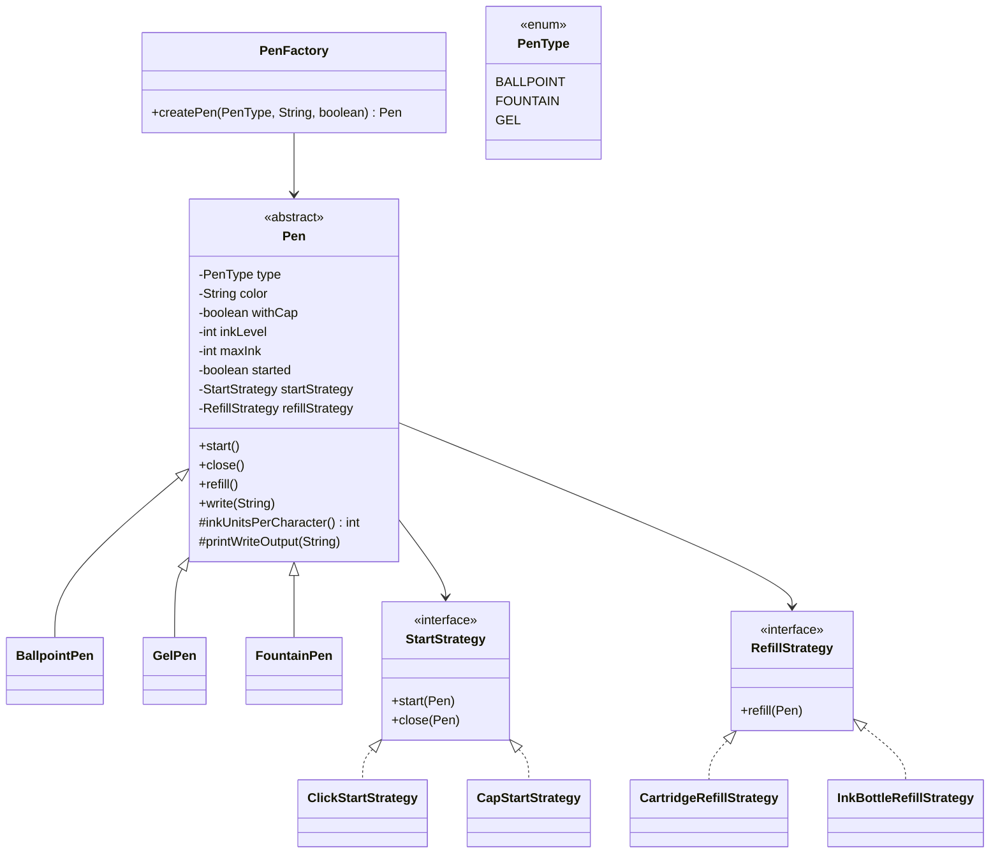

## Pen LLD Design

### Functional Requirements
- `start()`
- `write(String text)`
- `close()`
- `refill()`

### Attributes
- `type`: `BALLPOINT`, `FOUNTAIN`, `GEL`
- `color`: any valid non-empty string
- `withCap`: boolean (`true` => cap-based, `false` => click-based)

### Key Behavioral Rules
- Pen objects are created via `PenFactory`.
- `write()` throws `PenNotStartedException` if pen is not started.
- Writing consumes ink.
- If ink gets exhausted while writing, pen prints partial text and throws `InkDepletedException`.
- Writing style differs by pen type.
- Refill behavior differs by strategy.
- `start()` and `close()` behavior differs by cap/click mechanism.

## Pattern Selection

### 1) Strategy Pattern
- `StartStrategy` handles mechanism behavior (cap vs click) for start/close.
- `RefillStrategy` handles refill logic (cartridge replacement vs ink bottle top-up).

### 2) Factory Pattern
- `PenFactory` centralizes pen creation and strategy wiring.
- Client only specifies type, color, and cap/click choice.

## Class Responsibilities

### Core
- `Pen` (abstract):
	- Shared state: type, color, withCap, inkLevel, maxInk, started.
	- Shared behavior: start/close/refill orchestration.
	- Shared write flow and validation.
	- Extension hooks for pen-specific ink usage and output formatting.

### Concrete Pens
- `BallpointPen`
- `GelPen`
- `FountainPen`

Each concrete pen defines:
- ink consumption per character
- pen-type-specific output style

### Strategies
- Start:
	- `ClickStartStrategy`
	- `CapStartStrategy`
- Refill:
	- `CartridgeRefillStrategy`
	- `InkBottleRefillStrategy`

### Factory
- `PenFactory.createPen(PenType type, String color, boolean withCap)`

### Exceptions
- `PenNotStartedException`
- `InkDepletedException`

## Extensibility
- Add new pen type: create `XxxPen` + add one factory mapping.
- Add new mechanism: implement `StartStrategy`.
- Add new refill model: implement `RefillStrategy`.
- Existing core classes remain unchanged (Open-Closed Principle).

## Class Diagram (Mermaid)



## Flow Chart (Execution Flow)

```mermaid
flowchart TD
	A[Client calls PenFactory.createPen(type, color, withCap)] --> B{Validate input}
	B -- Invalid --> B1[Throw IllegalArgumentException]
	B -- Valid --> C[Pick StartStrategy: withCap ? CapStart : ClickStart]
	C --> D{Pen Type?}
	D -- BALLPOINT --> D1[Create BallpointPen + CartridgeRefill]
	D -- GEL --> D2[Create GelPen + CartridgeRefill]
	D -- FOUNTAIN --> D3[Create FountainPen + InkBottleRefill]
	D1 --> E[Return Pen]
	D2 --> E
	D3 --> E

	E --> F[Client calls start()]
	F --> G[StartStrategy.start() executes]
	G --> H[Pen state: started = true]

	H --> I[Client calls write(text)]
	I --> J{started?}
	J -- No --> J1[Throw PenNotStartedException]
	J -- Yes --> K[Compute writable chars from ink level]
	K --> L{Enough ink for full text?}
	L -- Yes --> L1[Print pen-specific style text]
	L1 --> L2[Reduce ink]
	L -- No --> M[Print partial text]
	M --> M1[Reduce remaining ink to zero]
	M1 --> M2[Throw InkDepletedException]

	L2 --> N[Client may call refill()]
	M2 --> N
	N --> O[RefillStrategy.refill() updates ink]
	O --> P[Client calls close()]
	P --> Q[StartStrategy.close() executes]
	Q --> R[Pen state: started = false]
```


