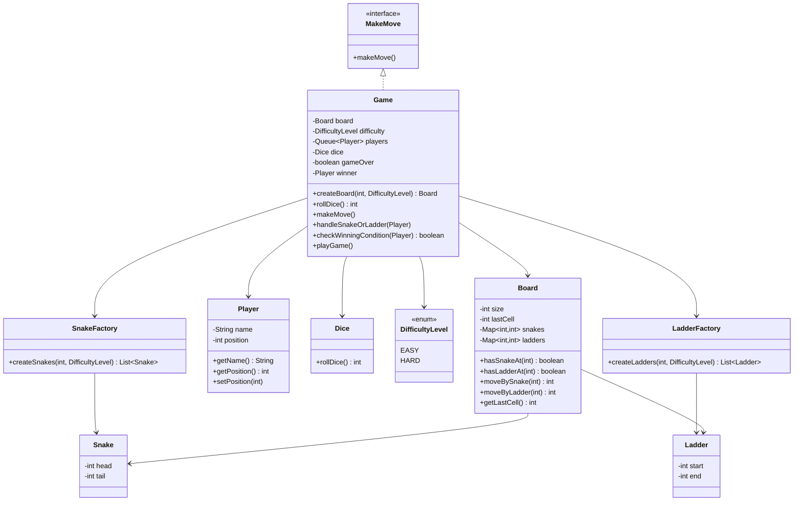

## Snake and Ladder V1 LLD

### Scope
This V1 design focuses on core gameplay:
- board creation with difficulty-based snakes and ladders
- multi-player turn handling
- dice rolls (1 to 6)
- snake and ladder transitions
- win detection

### Inputs
- `boardSize` (example: 10 for a 10x10 board)
- `playerNames` (list of players)
- `difficulty` (`EASY` or `HARD`)

### Difficulty Rules
- `EASY`:
	- player keeps rolling as long as dice value is 6
- `HARD`:
	- if a player rolls three consecutive sixes in the same turn, they lose the turn

## Required Functions and Behavior

### 1) `createBoard(boardSize, difficulty)`
- creates snakes and ladders based on difficulty using factories
- returns a `Board` with transitions

### 2) `rollDice()`
- returns random integer in range 1 to 6

### 3) `makeMove()`
- picks current player from turn queue
- rolls dice according to difficulty rule
- computes target position
- applies movement if within board bounds
- calls `handleSnakeOrLadder()`
- checks winner via `checkWinningCondition()`
- pushes player back to queue if no winner

### 4) `handleSnakeOrLadder(player)`
- if player lands on snake head, move to snake tail
- else if player lands on ladder start, move to ladder end

### 5) `checkWinningCondition(player)`
- returns true if player reaches last board cell

## Class Responsibilities

- `Game`:
	- orchestrates game loop and turns
	- contains all required core functions
- `Board`:
	- stores board size and snake/ladder transitions
- `Player`:
	- stores player name and current position
- `Dice`:
	- encapsulates random roll logic
- `SnakeFactory` and `LadderFactory`:
	- build difficulty-specific snake/ladder sets
- `Snake` and `Ladder`:
	- immutable position pairs

## Class Diagram (Mermaid)



## Flow Chart (V1 Turn Flow)

```mermaid
flowchart TD
		A[Start Game] --> B[createBoard(boardSize, difficulty)]
		B --> C[Initialize queue with players]
		C --> D{Game Over?}
		D -- No --> E[makeMove() for current player]
		E --> F[rollDice()]
		F --> G{Rolled 6?}
		G -- No --> H[Stop rolling]
		G -- Yes --> I{Difficulty == HARD and third consecutive 6?}
		I -- Yes --> J[Lose turn]
		I -- No --> K[Add roll to move and roll again]
		K --> F
		H --> L[Move player]
		J --> Q[Next player]
		L --> M[handleSnakeOrLadder()]
		M --> N[checkWinningCondition()]
		N -- Yes --> O[Declare winner and end]
		N -- No --> Q[Next player]
		Q --> D
		D -- Yes --> P[Stop Game]
```
